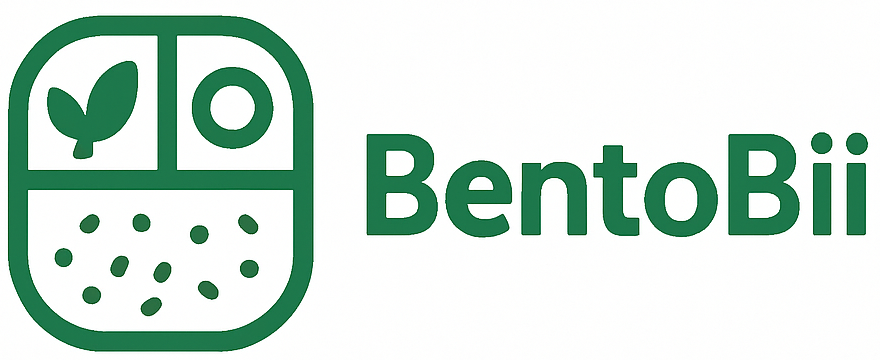

# Bentobii - 糖尿病ダイエットレシピ | Ricette Diabetiche

Welcome to **Bentobii**, a bilingual website offering a collection of over 100 diabetic-friendly recipes designed for weight loss, using ingredients commonly available in Japan.

## ✨ Features

*   **Bilingual Interface**: Seamlessly switch between Japanese (日本語) and Italian (Italiano).
*   **Extensive Recipe Collection**: Browse through more than 100 recipes, from main courses to healthy snacks.
*   **Advanced Search & Filter**: Find recipes by searching for ingredients or filtering by meal type (breakfast, lunch, dinner, snack).
*   **Favorites System**: Save your favorite recipes directly in your browser. Click the heart icon on a recipe to save it, and click the heart icon in the header to bring all your favorites to the top.
*   **Fully Responsive**: Enjoy a smooth experience on any device, from desktops to mobile phones.
*   **No Backend Needed**: The entire application runs in your browser, using `localStorage` to save your preferences.

## 🚀 Getting Started

To run this project locally, simply open the `index.html` file in your favorite web browser.

The live version will be available on GitHub Pages once it is deployed.

## 🛠️ Tech Stack

*   **HTML5**
*   **CSS3**
*   **Vanilla JavaScript (ES6)** 